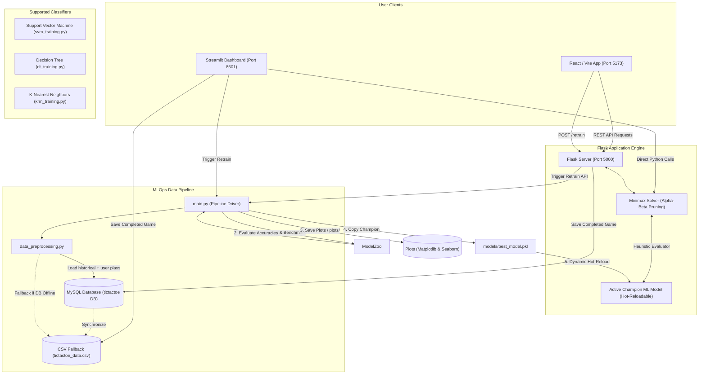

# 🎮 MLOps Powered Tic-Tac-Toe AI

> **Course Assignment: Machine Learning Operations (MLOps)**  
> A full-stack, end-to-end MLOps pipeline implementing continuous data collection, automated multi-model retraining, live performance visualization, and a hybrid search-prediction gameplay experience.

---

## 📌 Project Overview
This project is an advanced demonstration of MLOps principles applied to a classic game environment. Instead of standard deterministic heuristic evaluation functions, this Tic-Tac-Toe AI leverages a **hybrid AI approach**:
- **Minimax Search with Alpha-Beta Pruning** is used to plan moves ahead (look-ahead tree search).
- At the maximum search depth limit (or leaf node), a **Machine Learning model** is dynamically queried to evaluate the board state's heuristic strength (calculating the probability of a winning outcome).
- The pipeline logs real-time game results as new training data, triggers automatic retraining of multiple models on demand, compares performance metrics, selects the best performer ("champion"), and hot-deploys it in the backend engine without server restarts.

---

## 🏗️ System Architecture

The following diagram illustrates the flow of data, APIs, and ML models across the frontends, the Flask backend API, and the training pipeline:



---

## 🛠️ Key MLOps Features

1. **Continuous Data Feedback Loop**: Every single game played by a user is captured and persisted dynamically. If a MySQL database is active, it saves records there under the `user_game_data` table. If offline, it transparently falls back to `tictactoe_data.csv`. This provides human-guided feedback, enriching the training data with complex gameplay strategies over time.
2. **Multi-Model Training & Automated Benchmarking**: In every retraining cycle, three different classification algorithms are simultaneously trained and cross-validated:
   - **Support Vector Classifier (SVC)** (Linear Kernel)
   - **Decision Tree Classifier** (Gini/Entropy-based heuristic split)
   - **K-Nearest Neighbors (KNN)** (Distance-based classification)
3. **Champion Selection & Dynamic Redeployment**: The retraining orchestrator (`main.py`) evaluates accuracies on a hold-out test set, compares the three algorithms, selects the one with the highest accuracy score, and serializes it as `models/best_model.pkl`. The server then hot-reloads it into memory, completing **zero-downtime hot redeployment**.
4. **Automated Visual Dashboards**: When models retrain, performance plots are automatically updated and output to `plots/`:
   - `plots/accuracy_comparison.png`: A bar chart illustrating accuracy across models.
   - `plots/confusion_matrices.png`: Confusion matrices detailing true vs. predicted positives and negatives.
5. **Double Client Architecture**:
   - **Streamlit App (`streamlit_app.py`)**: A Python client displaying model performance charts, live game stats, difficulty configuration, and manual retraining execution.
   - **React/Vite App (`frontend/`)**: A sleek, dark-mode glassmorphic single-page web app built with React, Axios, Lucide React icons, and modern animations, showing real-time AI confidence and API pipeline connection badges.

---

## 📂 Project Directory Structure

```
game/
├── frontend/                  # React + Vite Web Client
│   ├── src/
│   │   ├── App.jsx            # Core React component managing board & state
│   │   ├── App.css            # Dark theme, glassmorphism, and keyframe animations
│   │   ├── index.css          # Core CSS resets
│   │   └── main.jsx           # React app entry point
│   ├── package.json           # Frontend packages and build scripts
│   └── vite.config.js         # Vite dev configuration
├── models/                    # Saved Serialized Pickle (.pkl) Model Files
│   ├── best_model.pkl         # Copy of the current champion model
│   ├── dt_model.pkl           # Trained Decision Tree classifier
│   ├── knn_model.pkl          # Trained K-Nearest Neighbors classifier
│   └── svm_model.pkl          # Trained Support Vector Machine classifier
├── plots/                     # Auto-generated pipeline charts
│   ├── accuracy_comparison.png# Bar chart comparing the three classifiers
│   └── confusion_matrices.png # Confusion matrix heatmaps
├── app.py                     # Flask backend API server (runs on Port 5000)
├── main.py                    # Retraining pipeline orchestrator (main driver)
├── data_preprocessing.py      # MySQL/CSV data loader, cleaner, and label encoder
├── dt_training.py             # Script to train and evaluate Decision Tree
├── knn_training.py            # Script to train and evaluate KNN
├── svm_training.py            # Script to train and evaluate SVM
├── simulate_games.py          # Synthetic data generator (runs 100 fast self-play games)
├── export_to_csv.py           # Helper to export MySQL data to CSV
├── requirements.txt           # Python backend dependencies
├── tictactoe_data.csv         # Baseline Tic-Tac-Toe dataset
└── README.md                  # Main Documentation (This file)
```

---

## 🧠 How the Hybrid AI Engine Works

1. **Board Representation**: The board state is represented as a 1D array of length 9 containing `'x'` (Player), `'o'` (AI), or `'b'` (blank).
2. **Move Search**: The minimax algorithm evaluates all possible branch moves up to a configurable search depth:
   - **Easy (Depth 1)**: Looks only 1 move ahead.
   - **Medium (Depth 3)**: Looks 3 moves ahead.
   - **Hard (Depth 6)**: Explores 6 plies deep.
3. **Leaf Heuristics using Machine Learning**:
   - If a terminal state (Win, Loss, or Draw) is found, standard absolute scoring is applied (`+10` or `-10` adjusted for depth to favor quick wins and delay losses).
   - If a non-terminal state is reached at maximum depth, the state is passed to `evaluate_board()`. 
   - `evaluate_board()` encodes the board to features (`b`=0, `o`=1, `x`=2) and passes them to the **active ML model**.
   - If the model supports probability outputs (like DT and KNN), it retrieves the model's confidence (`predict_proba`) of the AI winning. If not, it uses the hard class prediction.
   - The AI uses this probability score as its utility value to guide its search path, combining brute force lookup with statistical intuition!

---

## 🚀 Step-by-Step Installation & Run Guide

### 📋 Prerequisites
Make sure you have the following installed globally on your machine:
- **Python 3.8+**
- **Node.js & npm** (only needed for the React client)
- **MySQL / XAMPP** (optional; the app falls back to local CSV operations if offline)

---

### 💻 Local Deployment

#### 1. Setup the Python Virtual Environment
Open your terminal (PowerShell on Windows or Terminal on macOS/Linux) in the project root directory:
```bash
# Create a virtual environment
python -m venv .venv

# Activate the virtual environment
# On Windows (PowerShell):
.venv\Scripts\Activate.ps1
# On Linux/macOS:
source .venv/bin/activate

# Upgrade pip and install all backend requirements
pip install -r requirements.txt
```

---

#### 2. Run the Streamlit Interface (Client Option A)
If you want a unified, all-Python client showing visual analytics, game boards, and retraining controls in one place, launch Streamlit:
```bash
# Ensure your virtual environment is active
streamlit run streamlit_app.py
```
This automatically opens a browser tab running the UI at `http://localhost:8501`.

---

#### 3. Run the Dual-Stack Full Application (Client Option B)
If you want to run the advanced React glassmorphic web frontend backed by the Flask API server:

##### Step A: Run the Flask API Backend Server
In your first terminal tab (with active virtual environment):
```bash
python app.py
```
This launches the backend service on `http://localhost:5000` to serve prediction, AI move-generation, and retraining endpoints.

##### Step B: Run the React Vite Frontend
Open a **second** terminal window, navigate to the `frontend` folder, install packages, and run:
```bash
cd frontend
npm install
npm run dev
```
Open your browser to `http://localhost:5173` (or the address printed by Vite) to play the game on the premium React app.

---

#### 4. Configure MySQL Database (Optional)
To use real database synchronization for your feedback loop:
1. Open XAMPP and start **Apache** and **MySQL**.
2. Visit `http://localhost/phpmyadmin` in your web browser.
3. Create a new database called `tictactoe`.
4. Start playing. The backend will automatically create the `user_game_data` table on your first completed game and log states.

---

#### 5. Generate Synthetic Gameplay Data (High Speed)
If you want to rapidly populate the database or CSV with 100 new games of expert/random simulation, run:
```bash
# Ensure your virtual environment is active
python simulate_games.py
```
This generates synthetic gameplay data, logs it immediately to database/CSV, and makes it ready for subsequent retraining iterations.

---

#### 6. Trigger Retraining manually via Terminal
You can run the model search and benchmark pipeline directly from the command line:
```bash
python main.py
```
This loads preprocessed data, runs SVM, Decision Trees, and KNN, publishes a final summary report of accuracies to the terminal, updates `plots/`, and promotions the champion model.

---

## 📊 Evaluation & Visual Diagnostics
The plots directory contains visualizations generated by `main.py`:
- **`plots/accuracy_comparison.png`**: Displays accuracy results of SVM, Decision Tree, and KNN, allowing direct visual monitoring of which algorithm is currently the top performer.
- **`plots/confusion_matrices.png`**: Visualizes confusion matrices for all three models, facilitating identification of precision and recall trends in predicting Tic-Tac-Toe state outcomes.
